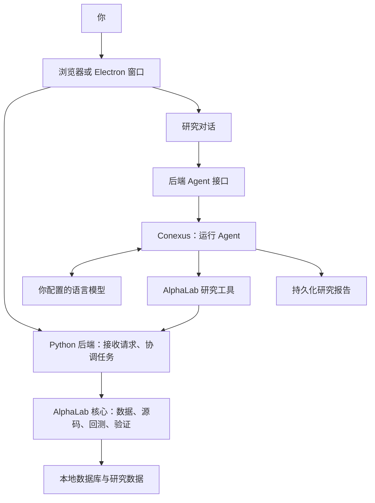
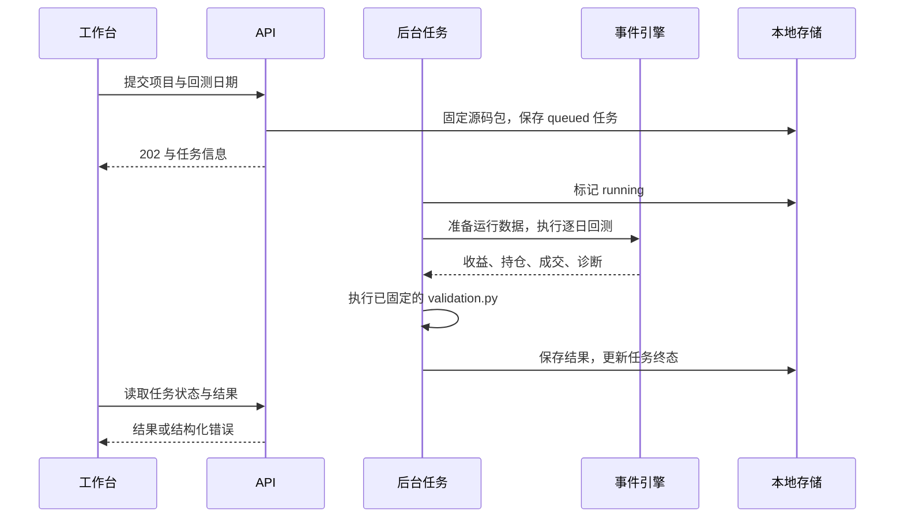

# AlphaLab：从第一个实验到读懂整个项目

本文面向熟悉金融概念、尚无编程经验的学生。以一个 20 日动量策略为例，说明如何部署 AlphaLab、完成研究，再读懂支撑它的代码与系统设计。金融指标不再从头定义，技术概念在使用时解释。

**阅读路线：**安装和使用读第 1—3 章；使用 Agent 接着读第 6 章；准备修改软件再读第 4、5、7 章。

| 章节 | 读完能做什么 |
| --- | --- |
| [1. 这是什么，为什么这样设计](#chapter-1) | 理解软件分工与项目文件 |
| [2. 在自己的电脑上部署](#chapter-2) | 安装、配置、启动、停止，并判断卡在哪一步 |
| [3. 完成第一个研究实验](#chapter-3) | 从准备数据走到回测、解释结果、比较修改 |
| [4. 后端：一次回测怎样发生](#chapter-4) | 找到请求、源码保存、执行和数据存储的位置 |
| [5. 前端：六个工作台怎样协作](#chapter-5) | 理解共享状态、编辑器和任务进度 |
| [6. Agent：让模型使用研究工具](#chapter-6) | 配置模型、提出可执行的请求、理解工具与报告 |
| [7. 贡献：把一个修改交给别人审查](#chapter-7) | 定位代码、开发、验证、提交 PR |
| [附录：技术术语与参考](#appendix) | 查询技术术语与正式文档 |

代码示例与参数规则见 [SDK 使用指南](docs/06_ALPHALAB_SDK_GUIDE.md)，工作台的“文档”抽屉也读取它；工程约定见 [开发指南](docs/03_DEVELOPMENT_GUIDE.md)。

<a id="chapter-1"></a>

## 1. 这是什么，为什么这样设计

AlphaLab 是一个运行在本机的量化研究框架和图形工作台。

它提供六个工作台：

| 工作台 | 你在这里回答的问题 | 主要内容 |
| --- | --- | --- |
| 项目 `project` | 这次实验研究什么？ | 项目名称、说明、当前源码状态、历史结果 |
| 数据 `data` | 实验材料从哪里来，覆盖哪些日期？ | 下载配方 `recipe.py`、数据模板、同步任务 |
| 因子 `factor` | 怎样给每只证券打分？ | 各个 `factors/<因子名>.py`、截面和历史检验 |
| 策略 `strategy` | 怎样把分数变成交易决策？ | `strategy.py` 中的标的池、选取、仓位、事件与成交规则 |
| 验证 `validation` | 这套规则在历史上发生了什么？ | `validation.py`、回测任务、收益、风险、归因 |
| 报告 `report` | 有什么证据，能得出多强的结论？ | Agent 的研究文档、表格、图表与来源 |

### 1.1 整体结构



**前端**负责让你看见、输入和操作；**后端**负责接收请求并执行规则；**核心库**把研究能力做成可复用的 Python 代码；**Agent**让语言模型选择并调用这些已有能力。

浏览器版与 Electron 桌面窗口使用同一套前端。Electron 可以理解为给网页加上桌面窗口、菜单和系统交互的外壳。

### 1.2 软件仓库与研究项目

电脑里的 `AlphaLab/` 是**软件仓库**，包含应用代码和工具。界面里新建的“第一次动量实验”是**研究项目**，包含你自己的研究源码。

研究项目在逻辑上长这样：

```text
第一次动量实验
├── recipe.py                准备数据
├── factors/
│   └── momentum_20d.py       计算因子
├── strategy.py              组织决策与成交规则
└── validation.py            评价已经发生的回测
```

这些名字是工作台管理的项目文件。它们的正式内容保存在本地数据库中，**不需要在软件仓库根目录手工新建这几个文件**。编辑器使用的磁盘镜像只是辅助文件，直接修改镜像不会保存研究项目。

软件仓库的分工则是：

| 目录 | 放什么 | 为什么单独放 |
| --- | --- | --- |
| `alphalab/` | 可复用的 Python 研究核心与 SDK | 脱离界面也能调用和测试 |
| `apps/api/` | FastAPI 后端 | 集中处理请求、任务与服务协调 |
| `apps/desktop/` | React 前端和 Electron 外壳 | 浏览器与桌面共享界面 |
| `integrations/conexus/` | AlphaLab 的 Agent 提示词、工具、输出约定 | 研究业务由 AlphaLab 定义 |
| `vendor/conexus/` | 校验过的 Conexus 上游源码副本 | 固定依赖版本，便于核查与构建 |
| `docs/`、`tests/`、`scripts/` | 文档、自动检查、维护命令 | 让使用和维护可重复 |
| `build/` | 编译后的网页与 Agent 程序 | 能从源码重新生成 |
| `data/` | 个人项目、行情、结果、Agent 历史与缓存 | 需要保留，和程序更新分开 |
| `artifacts/` | 部署压缩包、桌面安装包 | 用来分发，不当作源码 |

<a id="chapter-2"></a>

## 2. 在自己的电脑上部署

### 2.1 环境要求

部署就是让源码具备运行条件。第一次要安装运行环境、安装依赖、构建网页和 Agent；以后通常只需启动服务。

**依赖**是项目使用的现成工具包，例如处理表格的 pandas、构建界面的 React。

本教程采用仓库的学生部署基线：

| 准备项 | 本项目使用的版本或条件 | 用途 |
| --- | --- | --- |
| Python | 3.12 系列 | 后端、策略和验证代码 |
| Node.js 与 npm | Node 22.18 及以上的 22.x，或 24.x | 前端构建、本地 Agent；npm 管理相关依赖 |
| 项目源码或部署包 | 老师或维护者提供的版本 | 保证大家讨论同一份代码 |
| RQData 账号 | 有所需数据集和日期的访问权限 | 下载当前工作台使用的研究数据 |
| 模型接口 | 使用 Agent 时配置 | 让语言模型理解请求并调用工具 |
| Git | 贡献代码或用 Git 获取版本时需要 | 记录、比较和提交源码修改 |

安装程序可从 [Python 官网](https://www.python.org/downloads/)、[Node.js 官网](https://nodejs.org/en/download)、[Git 官网](https://git-scm.com/install/) 获取。按上表选版本和电脑架构，下载运行环境安装包，不要误选源代码压缩包。

RQData 和模型服务需自行配置。没有模型接口可先手动使用工作台；回测需要先同步研究数据。

### 2.2 打开终端，进入根目录

**终端**是输入命令的窗口。Windows 打开 PowerShell，macOS 打开“终端”；下文选择自己系统对应的命令执行。

先解压项目。**根目录**就是直接包含 `pyproject.toml`、`README.md` 和 `apps/` 的那一层。

Windows 示例；把路径换成你自己的：

```powershell
Set-Location "E:\Excalibur\AlphaLab"
Get-Location
Test-Path pyproject.toml
```

最后应显示 `True`。macOS 示例：

```bash
cd "$HOME/Projects/AlphaLab"
pwd
ls pyproject.toml
```

下面的命令均从根目录运行。安装命令结束、重新出现输入提示符后再执行下一步；报错时先解决当前步骤。

### 2.3 建立 Python 虚拟环境

**虚拟环境**是项目专用的 Python 与依赖环境，放在 `.venv/`。不同项目各用各的环境，依赖版本就不会互相影响。

Windows PowerShell：

```powershell
py -3.12 --version
py -3.12 -m venv .venv
.\.venv\Scripts\python.exe -m pip install --upgrade pip
.\.venv\Scripts\python.exe -m pip install -e ".[app,dev,rq]"
.\.venv\Scripts\python.exe -c "import alphalab; print(alphalab.__version__)"
```

如果安装器没有提供 `py` 命令，但 `python --version` 确认是 3.12，可用 `python -m venv .venv` 创建环境。后续仍直接调用 `.venv` 里的 Python。

macOS 终端：

```bash
python3.12 --version
python3.12 -m venv .venv
source .venv/bin/activate
python -m pip install --upgrade pip
python -m pip install -e ".[app,dev,rq]"
python -c "import alphalab; print(alphalab.__version__)"
```

最后应打印 AlphaLab 版本号。命令里只需要理解这些部分：

| 写法 | 含义 |
| --- | --- |
| `-m pip` | 用当前 Python 运行安装工具，避免装进另一个环境 |
| `-e` | 用可编辑方式安装，改动本地 Python 源码后可直接使用 |
| `.` | 安装当前目录的项目 |
| `app` | 安装后端 Web 服务依赖 |
| `dev` | 安装编辑器语言服务和开发检查工具 |
| `rq` | 安装 RQData 客户端 |

Windows 直接写出解释器路径即可，无须先运行激活脚本或修改 PowerShell 执行策略。macOS 每开一个新终端，需要重新激活；也可直接使用 `.venv/bin/python`。

### 2.4 构建网页和 Agent

两个系统先执行：

```bash
node --version
npm --version
npm --prefix apps/desktop ci
npm --prefix apps/desktop run build
```

`--prefix apps/desktop` 指定 npm 任务的执行目录；`ci` 按锁文件安装依赖，**锁文件**记录要安装的具体版本；`build` 把前端源码转换成浏览器能加载的文件。

成功标志是出现 `build/web/index.html`。它由后端通过 HTTP 提供服务，稍后访问 `/app/`；不要直接双击这个 HTML 文件来启动工作台。

然后构建本地 Agent 程序。Windows：

```powershell
.\.venv\Scripts\python.exe scripts/build_conexus_runtime.py
```

macOS，保持虚拟环境已激活：

```bash
python scripts/build_conexus_runtime.py
```

构建器读取仓库内已校验的 `vendor/conexus/`，在 `build/` 下安装依赖、编译，输出 `build/conexus/`。依赖下载需要网络。

如果收到的部署包已经同时包含 `build/web/index.html` 和 `build/conexus/UPSTREAM.json`，可以跳过本节构建。Python 环境仍要在自己的电脑创建；本地 Agent 仍需要 Node，首次启动可能安装当前平台的运行依赖。

### 2.5 配置自己的数据账号

在文件管理器中，把根目录的 `.env.example` **复制**一份并命名为 `.env`。已经有 `.env` 就直接编辑，避免覆盖原有配置。Windows 需显示文件扩展名，确保文件没有变成 `.env.txt`。

用文本编辑器填写这些字段，具体值由你的数据账号提供方给出：

```dotenv
RQ_USER=<你的数据账号>
RQ_PASSWORD=<你的数据密码>
RQ_HOST=<账号提供方给出的服务地址>
```

将尖括号及其中的说明替换成实际值。`.env` 是本机配置文件，**不要把凭据放进截图或 Git 提交**。修改后重启后端以加载新配置。

### 2.6 检查、启动、停止

Windows：

```powershell
.\.venv\Scripts\python.exe -m alphalab.cli dev doctor
.\.venv\Scripts\python.exe -m alphalab.cli dev serve
```

macOS，虚拟环境已激活：

```bash
alphalab dev doctor
alphalab dev serve
```

`doctor` 只读检查运行环境、构建、数据和端口，不打印凭据。首次未同步数据时可能显示 `degraded`、退出码 1；查看具体缺项后处理。

`serve` 启动 Python 后端，并默认启动本地 Conexus Agent 服务。终端持续占用、没有回到输入提示符，是服务正在运行的正常表现。

打开 [本地工作台](http://127.0.0.1:8000/app/)；[API 文档](http://127.0.0.1:8000/docs)供后面学习接口时使用。

地址里的 `127.0.0.1` 代表这台电脑，`8000` 是服务端口，`/app/` 是工作台路径。默认服务只监听本机。关闭网页不会停止服务；在启动它的终端按 `Ctrl+C` 才会停止后端和本地 Agent。

下次使用，进入根目录，选自己的系统执行上述 `serve` 命令即可。依赖、源码和构建没有变化时，无须重复安装。

### 2.7 Agent 模式与端口

在启动命令后加 `--agent local`、`--agent off` 或 `--agent remote` 可切换模式，默认使用 `local`。

| 模式 | 含义 | 需要什么 |
| --- | --- | --- |
| `local`，默认 | 启动随项目提供的本地 Conexus 服务 | Agent 构建、Node；对话还需模型配置 |
| `off` | 使用手动工作台 | Python 和已构建网页；运行时无需 Node |
| `remote` | 连接已有的外部 Conexus 服务 | 服务地址、发布标识、工作区令牌 |

本地模式无需 Conexus 云账号。Agent 在本机运行，模型可以在本机或远程，配置见 [第 6 章](#chapter-6)。

若 8000 被占用，可换端口。Windows 示例；macOS 用已激活环境中的 `alphalab dev serve --port 8100`：

```powershell
.\.venv\Scripts\python.exe -m alphalab.cli dev serve --port 8100
```

此时访问 `http://127.0.0.1:8100/app/`。本地 Agent 会自动选择另一个空闲端口，工具会收到正确的 Python 地址。

### 2.8 安装排错

| 现象 | 检查什么、怎样处理 |
| --- | --- |
| 找不到 `py`、`python3.12` 或 `node` | 确认已安装对应程序，再重新打开终端；用版本命令确认 |
| PowerShell 阻止执行 `npm.ps1` | 同样的 npm 命令可改用 `npm.cmd`，例如 `npm.cmd --prefix apps/desktop ci` |
| `No module named alphalab` | 确认在根目录安装，并使用 `.venv` 里的同一个 Python |
| `Frontend build is missing` | 完成 `npm ... ci` 和 `npm ... run build`，检查 `build/web/index.html` |
| Agent 构建缺失 | 运行 `build_conexus_runtime.py`；只学手动操作可先用 `--agent off` |
| `/app/` 无法连接 | 看启动终端是否退出、地址端口是否一致；不要同时重复启动同一服务 |
| `/` 显示 API 正常，但没有工作台 | 访问 `/app/`；确认前端已构建，并在构建后重新启动后端 |
| `doctor` 提示数据未就绪 | 继续第 3 章的数据同步；它和 Python 安装是不同步骤 |
| 数据连接失败 | 检查 `.env` 的文件名、账号、地址、网络和权限；修改后重启 |
| 编辑器没有提示或格式化 | 确认安装了 `dev` 依赖，并检查 `doctor` 中的 Pyrefly、Ruff |
| Agent 提示缺少模型 | 配置第 6 章的模型字段并重启；工作台手动操作不依赖模型 |

如果浏览器部署在安装依赖时卡在 Electron 二进制下载，可只跳过该二进制：

```powershell
$env:ELECTRON_SKIP_BINARY_DOWNLOAD = "1"
npm --prefix apps/desktop ci
Remove-Item Env:ELECTRON_SKIP_BINARY_DOWNLOAD
npm --prefix apps/desktop run build
```

这是 Windows 写法。macOS 对应的安装命令是 `ELECTRON_SKIP_BINARY_DOWNLOAD=1 npm --prefix apps/desktop ci`。以后要使用桌面窗口，再按 [本地部署指南](docs/07_LOCAL_DEPLOYMENT.md) 安装 Electron 二进制。

### 2.9 备份与更新

更新前停止服务，把 `.env`、`data/app/` 和整个 `data/runtime/` 备份到项目目录外。`data/runtime/` 还包含 Agent 的报告和运行记录，不能只备份行情分区。

取得新版本后保留个人配置与数据，按需要重装依赖、重建网页和 Agent，再启动验证。部署包生成与迁移步骤见 [本地部署指南](docs/07_LOCAL_DEPLOYMENT.md)。

<a id="chapter-3"></a>

## 3. 完成第一个研究实验

### 3.1 实验设置

先用五只股票跑通流程，核对参数、数据与实际执行是否一致。

| 项目 | 本次设定 |
| --- | --- |
| 项目名称 | 第一次动量实验 |
| 固定股票池 | `000001.SZ,000002.SZ,600000.SH,600036.SH,601318.SH` |
| 数据同步区间 | `2023-07-01` 至 `2024-12-31` |
| 第一轮回测区间 | `2024-01-01` 至 `2024-12-31` |
| 因子 | 项目自带的 20 日动量 |
| 选取规则 | 月末收盘后，按分数从高到低最多选 2 只 |
| 仓位规则 | 单只目标权重上限保留默认 `0.10` |
| 成交时点 | 保留默认：下一交易日开盘尝试成交 |
| 第一轮验证代码 | 保留项目自带内容 |

若账号没有这个历史区间的权限，整组平移到可访问的完整区间，并保留回测开始前的预热数据。后续对照实验使用同一组日期。

数据起点早于回测起点，为因子和交易状态的历史读取预留窗口。20 日动量需要 21 个收盘价；修改窗口后，也要检查同步范围是否足够。

### 3.2 新建自己的研究项目

进入“项目”，点击“新建研究项目”或“新建项目”，填写“第一次动量实验”。

新项目从只读模板 `sdk-v1-default` 复制配方、因子、策略和验证代码，无须从空文件开始。

确认已选中自己的可编辑项目。“源码检查通过”只表示代码校验通过，数据仍需单独同步。

### 3.3 同步数据

进入“数据”，按以下顺序操作：

1. 选择 `rq.a_share_daily` 对应的 A 股日线模板。第一轮使用行情、证券资料和交易状态，先把基础流程跑通。
2. 在“常用参数”填写实验卡片的开始日期、结束日期和五个代码。**标的留空表示模板全部标的**，这里不要留空。
3. 点击输入框外，等待“正在更新 Python”结束。日期和代码会写进当前项目的 `recipe.py`。
4. 点击“连接测试”。看到已连接，说明账号能访问供应商；这个操作本身不下载研究行情。
5. 确认参数后点击“运行并同步”，阅读本机 Python 执行提示并确认。等待任务结束，检查最终状态与错误摘要。

成功后，在因子工作台的行情终端搜索这些代码，检查历史行情。目录显示 `ready` 仍不保证每只股票、每个字段在指定日期都有数据。

需要财务与因子归因数据时，再选择 `rq.a_share_research` 同步。请求规划、命令行操作与自定义配方见 [数据操作](docs/04_DATA_OPERATIONS.md)。

本地研究数据是多个项目共享的仓库。**只同步五只股票，不等于策略只会选择这五只**；电脑上可能还有以前同步的其他股票。下一步要把实验范围写入策略。

### 3.4 设置股票池与策略参数

进入“策略”。左边是可视化设置，右边是完整的 `strategy.py`。

先按 [SDK 指南中的“五只股票入门实验”](docs/06_ALPHALAB_SDK_GUIDE.md#beginner-fixed-universe)，替换 `research_universe` 这一处函数并保存。那里给出了完整替换片段和逐步解释。保留文件中的其他函数。

该函数让固定名单与当前时点有效证券取交集。

接着在可视化面板找到“月末动量 Top N”，将 `top_n` 改为 `2`，使用面板统一的“应用全部设置”。保留月末调仓、20 日窗口、等权配置的 `max_weight=0.10` 以及下一开盘成交设置。

当前策略显式向动量因子传入 `window=20`。以后若要研究 60 日窗口，应同时核对策略里的因子调用参数；只改因子函数的默认值，不会覆盖一次显式传入的 20。

保存后，确认没有“未保存”或“待应用”提示，源码中的股票池与 `top_n=2` 符合本次设定。表单与代码不能同时编辑，原因见第 5.3 节。

### 3.5 检验因子

进入“因子”，选中已有的“20 日动量”。先不改它。

在“单因子检验”中，将“开始”设为 `2024-01-01`、“结束”设为 `2024-06-28`。“截面检验”使用结束日期作为评估时点；“历史分布”和“研究证据”使用所选区间。检查日期、有效样本与缺失值。

从代码角度看，输入是按日期和证券排列的 `DataFrame`（二维表），输出是以证券代码为索引的 `Series`（一维结果）。函数、参数、索引和缺失值的逐行解释见 [最小因子的代码拆解](docs/06_ALPHALAB_SDK_GUIDE.md#beginner-factor-reading)。

### 3.6 预览策略

回到“策略”，切换到预览视图，点击“预览完整策略”。当前页面由后端使用本地数据范围的结束日期，结果中会显示“预览日期”；这里没有独立的日期选择框。观察评分、入选证券、目标权重和执行策略。

若共享仓库已有更晚的行情，而这五只只同步到实验结束日，默认预览可能缺少所需数据。此时可通过项目预览 API 或 Agent 明确指定 `as_of_date=2024-06-28`；第 3.7 节的完整回测仍按你填写的起止日期执行。

核对默认仓位规则：每只权重取 `min(单只上限, 1 ÷ 入选数量)`，其中 `min` 表示取较小值。两只有效候选、单只上限 10% 时，总目标仓位为 20%。`top_n` 与 `max_weight` 是两个独立参数，修改前者不会自动调整后者。

预览用于检查一次决策的输出；完整回测才会串起逐日事件与实际成交。

### 3.7 运行完整回测

进入“验证与回测”：

1. 在“回测策略”确认选中“第一次动量实验”。
2. 设置开始日期 `2024-01-01`、结束日期 `2024-12-31`。
3. 右侧是 `validation.py`，第一轮保留原样。若编辑过代码或参数，先保存或应用。
4. 点击“运行回测”，确认执行受信任的本机 Python。
5. 等待任务从排队、运行进入终态，再读结果。不要因为等待较久而反复提交。

完成后，在“历史 Run”中应能找到这次记录。这里的 Run 表示一次已经保存的回测结果。它保留当时的策略和验证内容；后面修改代码，需要新运行一次才能看到变化。

### 3.8 核对运行结果

先核对执行记录，再分析绩效。

| 顺序 | 看什么 | 能回答什么 |
| --- | --- | --- |
| 1 | 数据和执行警告 | 数据缺口、状态补齐或输入假设是否影响实验 |
| 2 | 尝试成交数、成功成交数、拒单原因 | 策略是否真的建立了持仓，哪些目标没实现 |
| 3 | 净值、收益、现金与仓位 | 实际资金路径是否符合规则 |
| 4 | 回撤、换手、集中度 | 经历了怎样的亏损过程，调仓是否频繁 |
| 5 | 基准、Alpha/Beta、研究证据 | 收益可能来自什么，样本足不足以支持解释 |

注意当前结果实际采用的基准与覆盖范围；界面的等权基准不必然对应某个市场指数。软件还提供三类容易混淆的评价字段：

| 字段或分析 | 具体在评价什么 |
| --- | --- |
| `execution_reliable` | 引擎的执行数据检查是否通过 |
| `research_valid` | 冻结的 `research_quality` 是否通过项目设定的成交质量标准 |
| `research_evidence` | 统计证据与样本是否充分 |

旧验证代码缺少质量评价函数时，显示“未评价”，而非“未通过”。

### 3.9 修改参数并比较

回到“策略”，只把 `top_n` 从 `2` 改成 `3`，应用全部设置。日期、固定股票池、因子窗口、单只上限和验证代码保持相同，再运行一次回测。

有三只有效候选时，总目标仓位从 20% 变成 30%。这次比较用于验证参数如何影响执行；解释绩效差异时，要同时考虑持仓和现金比例变化。

记录两次结果：

| 记录项 | 第一轮 | 第二轮 |
| --- | --- | --- |
| `top_n` | 2 | 3 |
| 单只上限 | 10% | 10% |
| 实际成功成交数 | 填自己的结果 | 填自己的结果 |
| 累计收益与最大回撤 | 填自己的结果 | 填自己的结果 |
| 执行警告和缺失数据 | 填自己的结果 | 填自己的结果 |

### 3.10 生成报告

回测结果保存在验证页；报告工作台的文档由 Agent 创建或更新，不会在每次回测后自动生成。尚未配置 Agent 时可先记录对照表。

配置 Agent 后，可以发出：

> 请读取“第一次动量实验”的最近两次回测，确认它们的日期、股票池和参数是否一致，只比较已保存的结果，不修改项目、不重新回测。请生成一份报告，解释收益、最大回撤、现金比例、成功成交数和警告；证据不足的地方直接说明。

同一主题通常更新已有文档。当前报告历史由整个 AlphaLab 发布工作区共享，不按所选研究项目隔离。

### 3.11 研究流程排错

| 现象 | 原因与动作 |
| --- | --- |
| 因子全是空值 | 先核对价格字段和实际日期覆盖，特别是预热区间 |
| 选出了名单外股票 | 数据仓库是共享的；检查固定范围是否写入并保存到 `@universe` |
| 改了窗口，结果没变 | 检查是否保存；检查策略调用是否仍显式传入旧窗口 |
| 选两只，却没有满仓 | 查看单只上限；默认每只最多 10% |
| 有买入目标，却没有成交 | 查停牌、价格限制、成交容量、现金和状态缺失的拒单记录 |
| 结果显示 0% | 先查是否有交易和有效样本；空执行不能解释为策略表现稳定 |
| `Runtime data coverage is insufficient for this request.` | 对照项目配方补齐缺少的标的、日期、预热和字段，再运行 |
| `PARTIAL_MARKET_STATE` | 阅读哪些交易状态不全、哪些值由项目补齐，以及受影响订单；警告不等于整个任务失败 |
| `DATASET_BUSY` | 当前有数据写入争用，等待写入结束后重试 |
| 改了 `validation.py`，旧结果没变 | 旧结果读取当时保存的分析输出；新源码只影响新的运行 |

<a id="chapter-4"></a>

## 4. 后端：一次回测怎样发生

### 4.1 请求与 API

点击“运行回测”时，浏览器通过 **HTTP**（客户端与服务器通信的协议）向后端发请求。**API** 是程序之间约定的入口，一次请求包括动作、地址和内容：

```text
POST /api/backtests/jobs
动作：创建任务
内容：研究项目、起止日期、执行确认
```

`GET` 通常用于读取，`POST` 用于创建或发起操作，`PUT` 用于更新。请求和响应中的 **JSON** 用键和值表达信息，例如 `{"status": "ok"}`。

可以先做一个不会修改数据的请求。服务启动后，Windows PowerShell 执行：

```powershell
Invoke-RestMethod "http://127.0.0.1:8000/"
```

应看到 API 名称和 `status=ok`。这与浏览器访问同一地址调用的是同一个入口；端口需与实际服务一致。

请求首先进入 [apps/api/main.py](apps/api/main.py)。它创建 FastAPI 应用、挂载各类路由，并在网页构建存在时提供 `/app/`。FastAPI 根据请求路径找到对应的 Python 函数。

### 4.2 路由、服务与核心

以运行回测为例：

```text
POST /api/backtests/jobs
          ↓
routers/backtests.py               请求字段正确吗？执行确认存在吗？
          ↓
services/backtest_job_service.py   固定哪份源码？怎样排队、保存任务状态？
          ↓
alphalab/strategy/engine.py        如何逐日决策、成交、记账？
          ↓
验证运行器和结果存储               怎样评价本次输出并留存？
```

**路由层**理解 HTTP；**服务层**协调一次业务操作；**核心层**实现研究规则。这样测试核心计算时，不必先打开网页；换一个界面，也不用重写成交规则。

| 要找的行为 | 入口 |
| --- | --- |
| 项目和策略请求 | [routers/strategy.py](apps/api/routers/strategy.py)、[strategy_service.py](apps/api/services/strategy_service.py) |
| 回测任务 | [routers/backtests.py](apps/api/routers/backtests.py)、[backtest_job_service.py](apps/api/services/backtest_job_service.py) |
| 数据配方与同步 | [routers/data_sync.py](apps/api/routers/data_sync.py)、[data_sync_service.py](apps/api/services/data_sync_service.py) |
| 验证源码 | [routers/validation.py](apps/api/routers/validation.py)、[alphalab/validation/](alphalab/validation/) |
| 已保存的结果 | [result_service.py](apps/api/services/result_service.py)、[alphalab/store.py](alphalab/store.py) |

### 4.3 保存、校验与版本记录

假设把因子名字改成 `momentum_new`，策略还在调用 `momentum_20d`。单独看两个文件都可能语法正确，但组合起来已经断开。

因此保存策略或因子时，后端会组装完整模块，再做检查：

1. Python 语法、SDK 版本和注册入口是否正确。
2. 入口名称、函数参数、数据要求和因子引用是否匹配，是否形成循环依赖。
3. 完整模块能否导入，并在小型探测输入下产生符合约定的输出。
4. 全部通过后，在同一数据库事务里更新当前源码并记录不可变源码包。

**事务**表示一组写入一起成功或一起失败。它让系统不会保存出“新因子已经生效，策略却还是旧的”这种半完成状态。相关实现主要在 [source.py](alphalab/strategy/source.py)、[repository.py](alphalab/strategy/repository.py) 和 [sdk_runtime.py](alphalab/strategy/sdk_runtime.py)。

源码包记录参数、入口清单、依赖、环境信息和源码哈希。**哈希**是内容指纹，用来核对两份内容是否一致。

写入时还可能带上“我开始编辑时看到的源码哈希”。如果另一窗口已经保存了更新，后端可以拒绝用旧页面覆盖新内容。这叫**乐观并发控制**：允许大家读取，但提交时核对有没有变化。

### 4.4 异步任务与结果

提交接口先检查输入、固定策略与验证源码包、保存排队任务，再返回 `202 Accepted`，表示请求已接收。计算在后台继续，界面另行查询进度，这叫**异步任务**。



`queued` 是排队，`running` 是执行中，`succeeded` 是成功；任务也可能失败或中断。数据准备在后台任务中完成。

任务 ID 用来查询进度；成功后得到的回测结果 ID 用来查询历史结果。它们对应不同对象。查看明细时：

| API | 用途 |
| --- | --- |
| `GET /api/backtests/jobs/{job_id}` | 读取任务当前状态 |
| `GET /api/backtests/jobs/{job_id}/wait?timeout_seconds=25` | 等待状态变化或超时后返回 |
| `GET /api/backtests/{backtest_id}/summary` | 读取简要结果、警告和执行计数 |
| `GET /api/backtests/{backtest_id}/events` | 分页读取事件或成交记录 |

花括号内需替换为实际 ID。分页接口每次只返回一部分记录，避免把全部每日事件一次性传给界面或模型。

### 4.5 PIT 在代码中怎样落实

策略通过 **Context** 访问数据，而不是直接读取数据库。Context 按当前评估时点截断历史，财务数据按披露时间筛选，证券池按上市和退市区间处理。默认执行策略再把收盘信号安排到下一交易日开盘尝试成交。

这些约束由 SDK 数据入口和事件引擎落实。自行读取文件、访问网络或把未来数据写成代码常量，会绕开这套数据边界；研究代码应使用公共 SDK，并检查证券快照等来源警告。

### 4.6 事件引擎与验证代码

在每个交易事件，引擎构造当前 Context，调用到期的选股、因子、信号、组合与事件逻辑，验证目标和状态，再在允许的后续时点尝试成交。

Context 还提供真实持仓；`state` 则保存策略跨事件使用的变量，如冷却期和触发状态。实际持仓以引擎的 portfolio 为准，避免在 `state` 中维护一套与实际成交脱节的持仓。

目标权重通过引擎的价格、停牌、涨跌停、流动性、现金和费用检查后，才转化为实际成交。

实际订单缺少交易状态时，`strategy.py` 中的 `@execution_data_fill` 可补齐允许补的缺失值，但不能覆盖已知值。必要状态仍缺失的订单会被拒绝；补齐与拒单计数保留在结果中。

价格字段按用途区分：研究使用复权价格，涨跌停检查使用对应成交日的未复权价格 `raw_open` 或 `raw_close`。

默认策略对一次目标只在约定时点尝试一次：买不到的部分留现金，卖不出的部分留持仓。需要候补股票、重新分配或跨日重试，就要在项目策略里明确写出规则。

成交与核算核心在 [engine.py](alphalab/strategy/engine.py)。`validation.py` 在这些结果产生后执行，只获得冻结输入的副本，用来计算收益、归因、风险和质量评价；修改它不会倒过来改变引擎已经发生的成交。

### 4.7 数据格式与存储

```text
recipe.py → 数据供应商 → 字段与代码规范化 → 本地 Parquet 分区
                                              ↓
                                    DataEngine → 时点 Context
```

**Parquet** 是适合按列存储表格的文件格式。行情按时间分区，查询一只股票的一段历史时，后端尽量先筛选所需证券和日期，再创建计算用表格。这样无需为一张小图反复加载全市场数据。

**SQLite** 是保存在本地文件里的数据库，适合管理项目、源码包和任务等结构化状态。不同性质的数据分别存放：

| 位置 | 内容 | 维护含义 |
| --- | --- | --- |
| `data/app/` | 项目源码、保存记录、回测结果等应用数据 | 备份并保留 |
| `data/runtime/` | 下载分区、同步状态、运行数据等 | 备份并保留 |
| `data/runtime/editor/` | 语言服务使用的源码镜像 | 派生文件，不是正式保存入口 |
| `data/runtime/conexus/` | 本地 Agent 图状态、报告、Run、凭据及日志 | 包含个人研究成果，需要备份 |
| `data/cache/` | 缓存 | 用于加速，不代替正式数据 |

同步按块写入并记录进度，后续结合已有进度和重叠刷新继续处理。失败后查看任务状态，再提交必要范围。

多个回测可以共享读取数据；数据发布需要独占写入。每个后台回测任务还使用独立进程锁，避免两个 API 服务重复执行同一个任务。

历史结果保持不变；重新运行则可能受到数据修订或环境变化影响。复现除了固定源码和参数，还需要保留数据摘要、环境信息及必要的数据备份。

### 4.8 子进程与执行权限

**进程**是操作系统中正在运行的程序实例。后端启动独立的 Python 子进程执行策略，验证也有独立的运行过程；超时、崩溃与输出大小限制用于控制故障影响。

子进程不限制代码的文件和网络权限，不能当作安全沙箱。保存策略或因子也会触发探测执行，因此界面和 API 都要求明确的 Python 执行确认。

<a id="chapter-5"></a>

## 5. 前端：六个工作台怎样协作

### 5.1 组件与页面入口

前端使用 React 与 TypeScript。**组件**是一块有自身输入和显示逻辑的界面，例如按钮、行情图或整个策略工作台；React 把组件组合成页面。TypeScript 为 JavaScript 增加类型检查，帮助开发时发现字段和参数不匹配。

入口大致按这个顺序组织：

```text
main.tsx → App.tsx → Workspace.tsx
                         ├── 导航、布局、工具栏
                         ├── 当前工作台组件
                         └── 研究 Agent 区域
```

`.tsx` 是可包含界面标签的 TypeScript 文件。先读 [App.tsx](apps/desktop/src/App.tsx) 的整体组织，再看 [Workspace.tsx](apps/desktop/src/Workspace.tsx) 如何组合工作区。

| 界面 | 主要组件 |
| --- | --- |
| 项目 | [ProjectWorkbench.tsx](apps/desktop/src/widgets/project/ProjectWorkbench.tsx) |
| 数据 | [DataWorkbench.tsx](apps/desktop/src/widgets/data/DataWorkbench.tsx) |
| 因子 | [FactorWorkbench.tsx](apps/desktop/src/widgets/factors/FactorWorkbench.tsx) |
| 策略 | [StrategyWorkbench.tsx](apps/desktop/src/widgets/strategy/StrategyWorkbench.tsx) |
| 验证与回测 | [BacktestWorkbench.tsx](apps/desktop/src/widgets/backtest/BacktestWorkbench.tsx) |
| 报告 | [ReportWorkbench.tsx](apps/desktop/src/widgets/research/ReportWorkbench.tsx) |
| Agent 对话 | [ResearchAgent.tsx](apps/desktop/src/widgets/research/ResearchAgent.tsx) |

### 5.2 状态管理

**状态**就是界面此时需要记住的信息，例如选中哪个项目、编辑器有没有修改、任务是否完成。AlphaLab 中可以分三层理解：

| 状态 | 例子 | 管理方式 |
| --- | --- | --- |
| 单个组件的临时状态 | 一个折叠区是否展开、输入框尚未保存的文字 | React 局部状态 |
| 工作台共享状态 | 当前项目、策略源码、保存状态、因子列表 | `StrategySdkContext` |
| 服务端事实 | 数据目录、保存后的源码、任务、报告、对话历史 | 后端接口与前端查询、刷新逻辑 |

[StrategySdkContext.tsx](apps/desktop/src/contexts/StrategySdkContext.tsx) 让工作台使用同一个项目。比如在验证页换项目，其他相关视图也应理解为项目选择发生变化。

**缓存**是暂存的读取结果，用于减少重复请求；React Query 管理部分查询缓存。正式源码、任务、研究对话和报告以服务端存储为准，浏览器主要保留主题、布局等偏好。

### 5.3 表单与 Python 的同步

下面是函数定义的第一行，示意参数写法，不是完整函数：

```python
def monthly_momentum(context, state, *, top_n: int = 10):
```

现在只关注 `top_n: int = 10`：这个参数是整数，默认值是明确写出的 10。界面可以把它显示成一个数字输入框。

后端通过 **LibCST** 修改具体语法节点。CST 可以理解为一棵保留注释和排版的代码结构树。它能定位“这个已注册函数的这个参数”，不会把文件中所有 `10` 都替换掉。

直接写出的 `10` 叫**字面量**，界面可以识别并编辑；复杂计算无法投影成表单时，保留为自定义 Python。

策略工作台有两条互斥的编辑路径：

```text
改 Python → 存在未保存代码 → 先保存，恢复表单编辑
改表单    → 存在待应用设置 → 显示只读代码预览 → 统一应用
```

互斥编辑避免旧表单覆盖新代码；统一应用让多个相关参数一次保存，避免留下中间状态。

研究项目中的因子文件单独打开，策略编辑器只打开 `strategy.py`。后端负责组装；前端不该把派生的整模块当成策略文件写回。

### 5.4 编辑器与语言服务

所有 Python 输入共用 [PythonEditor](apps/desktop/src/components/python/PythonEditor.tsx)。它使用 Monaco 编辑器，并连接不同的辅助服务：

| 部分 | 作用 |
| --- | --- |
| Monaco | 代码显示、光标、编辑模型、问题标记 |
| Pyrefly | 类型检查、补全、跳转、悬停说明等 |
| Ruff | 格式化、代码风格检查和安全修复 |
| AlphaLab 补全与后端检查 | 当前 SDK 方法、数据字段、项目因子和契约错误 |

**LSP** 是编辑器与语言服务之间传递补全、诊断、跳转请求的标准协议。浏览器通过 **WebSocket**（持续的双向连接）与后端的 Pyrefly、Ruff 进程通信。

后端为语言服务生成 `data/runtime/editor/` 下的源码镜像。正式保存仍走项目 API；语言服务只允许使用预设的程序。

编辑器按需加载，输入功能先可用，补全等语言服务随后连接，减少打开页面的等待。

工作台的“文档”抽屉也共享一个组件：[SdkDocumentation.tsx](apps/desktop/src/components/shared/SdkDocumentation.tsx)。它通过 `/api/sdk-docs` 读取统一 SDK 指南；改教程时应改原文，不能往每个页面复制一份帮助文案。

### 5.5 实时进度与状态校对

Agent 的文字和工具活动通过 **SSE** 推送，即服务器沿一条 HTTP 连接持续向页面发送事件。界面还每两秒查询一次 Agent Run 快照，防止断线时漏收完成通知。

一旦确认完成、失败、阻塞或取消，迟到的“运行中”消息不能把界面改回去。这个规则避免回答已经结束但转圈一直不停。相关代码在 [usePublishedAgent.ts](apps/desktop/src/hooks/usePublishedAgent.ts) 和 [runState.ts](apps/desktop/src/lib/conexus/runState.ts)。

这是 Agent Run 的更新逻辑；回测任务另有自己的状态查询。

### 5.6 浏览器模式、开发模式与桌面模式

| 场景 | 页面从哪里来 | 后端如何连接 |
| --- | --- | --- |
| 日常浏览器使用 | Python 提供 `build/web/`，访问 8000 的 `/app/` | 同一地址下的 `/api` |
| 前端开发 | Vite 在 5173 提供页面，修改后快速更新 | Vite 把 `/api` 和 WebSocket 代理到后端 |
| Electron | 桌面窗口承载同一套 React 页面 | 仍需要 Python 后端 |

**Vite** 是前端开发与构建工具；**代理**让页面向自己的 `/api` 发请求，由开发服务器转交给 Python。默认地址在 [vite.config.ts](apps/desktop/vite.config.ts) 配置。

Electron 另外有主进程和 preload：主进程管理窗口，preload 暴露受限的桌面能力，React 负责画界面。它们在 [apps/desktop/electron/](apps/desktop/electron/) 中。浏览器模式不显示桌面专用标题栏；修改共享组件通常会同时影响两个界面。

<a id="chapter-6"></a>

## 6. Agent：让模型使用研究工具

### 6.1 模型、工具与运行框架

Agent 让语言模型通过工具读取项目、执行计算并解释结果：

```text
理解当前请求 → 读取必要事实 → 选择工具 → 获得真实结果
                   ↑                         ↓
                   └── 还缺证据时继续 ────────┘
                                      ↓
                              解释结果、交付报告
```

模型负责判断下一步用哪个工具；工具把操作交给 AlphaLab API；回测数字来自实际引擎结果。Conexus 负责运行这个循环，管理工具调用、节点变更和持久报告。

**节点**是工作区里可定位的对象，如工具或文档；**Harness** 把 Agent、工具和输出约定组织成一个可运行入口。

### 6.2 配置模型

先按第 2 章完成本地 Agent 构建。编辑现有 `.env`，填写模型服务给出的信息：

```dotenv
CONEXUS_MODEL_BASE_URL=
CONEXUS_MODEL_ID=
CONEXUS_MODEL_API_KEY=
BRAVE_SEARCH_API_KEY=
```

| 字段 | 填什么 |
| --- | --- |
| `CONEXUS_MODEL_BASE_URL` | 兼容 Chat Completions 的接口根地址，通常以 `/v1` 结尾；不是聊天网页地址 |
| `CONEXUS_MODEL_ID` | 该服务实际提供、你的账号可以使用的模型 ID |
| `CONEXUS_MODEL_API_KEY` | 远程模型服务提供的密钥；本机回环模型服务可留空 |
| `BRAVE_SEARCH_API_KEY` | 可选的网页搜索密钥；不影响 AlphaLab 数据、因子和回测工具本身 |

保存配置、停止服务，再运行 `dev serve`。打开工作台的研究 Agent，先发送：“请解释当前项目的研究流程，不修改项目，不运行 Python。”

连接失败时核对接口根地址、模型 ID、密钥和网络；本地日志在 `data/runtime/conexus/host.log`，分享报错前先去除凭据。

使用本机模型时，要先单独启动模型服务。使用远程模型时，发送给模型的请求和研究上下文会到达所配置的服务；AlphaLab 安装包本身不提供模型。

已有外部 Conexus 服务时，按 [本地部署指南](docs/07_LOCAL_DEPLOYMENT.md) 配置 `--agent remote`；普通本地安装无需配置外部工作区凭据。

### 6.3 请求示例

研究请求交代清楚：对象、范围、规则、允许的动作和产物。

**定位异常：**

> 请检查“第一次动量实验”最近一次回测为什么没有成交。读取任务摘要，必要时读取少量成交事件，区分没有候选、数据缺失和交易被拒绝。先不要修改或重新运行。

**在现有项目改参数并重跑：**

> 请修改“第一次动量实验”，把策略的 top_n 改成 3，其他设置保留。允许保存源码和执行保存检查，再按 2024-01-01 至 2024-12-31 运行回测。比较修改前后的最近两次结果，解释现金比例和成交差异。

**从头做一个有范围的实验：**

> 请新建“五股动量研究”。固定研究 000001.SZ、000002.SZ、600000.SH、600036.SH、601318.SH，使用 20 日动量，月末收盘选前两只，每只目标上限 10%，下一交易日开盘尝试成交。同步范围为 2023-07-01 至 2024-12-31，回测范围为 2024-01-01 至 2024-12-31。我允许为本次研究创建和修改项目、运行数据配方与 Python 检验、回测，并生成报告。先检查数据覆盖；若权限或字段不足，说明缺口。报告要包含实际成交、警告和结论限制。

### 6.4 工具接口

Agent 实际使用两个逻辑工具，通过 `command` 指定操作、通过 `args` 提供参数：

| 工具 | 负责什么 | 代表性命令 |
| --- | --- | --- |
| `alphalab_project_files` | 研究项目和正式源码 | `projects.create`、`files.read`、`files.write`、`files.install_factor_template` |
| `alphalab_project_run` | 数据、检验、回测、结果与输出准备 | `recipe.sync`、`factor.snapshot`、`backtest.run`、`backtest.wait`、`backtest.summary` |

例如，运行一个已保存因子的截面检验，工具输入的形状是：

```json
{
  "command": "factor.snapshot",
  "args": {
    "project_id": "替换为项目实际ID",
    "factor_id": "momentum_20d",
    "as_of_date": "2024-06-28"
  },
  "confirm_python_execution": true
}
```

这是工具日志中的输入形式，无须粘贴到聊天框。`project_id` 是内部标识，不等于项目名称；最外层的确认字段表示本次调用具有执行授权。

完整命令说明在 [alphalab-sdk-v1/SKILL.md](integrations/conexus/alphalab-research-agent/skills/alphalab-sdk-v1/SKILL.md)，启动或注册时注入 Agent 提示词，告诉模型怎样调用工具。

两个入口统一参数形式，后端仍逐条校验命令。源码操作只允许 `recipe.py`、`strategy.py`、`validation.py` 和单因子文件路径。

### 6.5 研究执行流程

1. **选定项目。** 新建策略从 `sdk-v1-default` 创建项目；明确要求修改现有项目时，才继续编辑该项目。
2. **读取材料。** 先读摘要，再按需读取源码与有限数据样本。这样能控制模型输入长度，全量数据仍留在本地。
3. **保存修改。** 与工作台共用校验、跨文件探测和版本记录。
4. **执行回测。** `backtest.run` 返回任务 ID，Agent 用 `backtest.wait` 等待终态后读取结果。
5. **处理数据缺口。** 在已授权范围内，用项目配方同步缺失数据并确认补齐，成功后对原回测最多重试一次；仍有缺口就报告错误。
6. **交付结果。** 依据工具返回的证据解释结果，按需创建或更新报告。

每个阶段的应用规则在 [Agent 配置](integrations/conexus/alphalab-research-agent/agents/AlphaLab-Research-Agent.agent.json) 和 [Harness 配置](integrations/conexus/alphalab-research-agent/harness.json) 中；图组装逻辑在 [research-canvas.mjs](integrations/conexus/research-canvas.mjs)，本地适配在 [local-host.mjs](integrations/conexus/local-host.mjs)。

### 6.6 报告存储与界面交付

正式报告保存在 Conexus 的 Document 节点中，同一主题优先更新已有文档。AlphaLab 不在 SQLite 中维护第二份 Markdown 副本。

除了文档本身，Agent 还要一致地交付三类工作区信息：

| 输出 | 用途 |
| --- | --- |
| Decision Notebook | 当前研究的结构化记录与交接信息 |
| Workspace Result | 本轮报告、表格或图表的结果描述 |
| Workspace Commands | 让界面切换项目、打开结果等声明式操作 |

它先调用 `workspace.outputs.prepare`，由后端校验输出结构、当前请求和报告之间的关系，并生成完整操作；再用一次原子 `edit` 写入三类输出，最后 `complete`。

这样可以避免“新报告已经生成，导航却打开上一轮结果”。浏览器接收时还会核对请求对应关系和命令是否合法。表格、图表需要遵守 [workspace-output.schema.json](integrations/conexus/alphalab-research-agent/workspace-output.schema.json)，报告 Markdown 经安全渲染，不能靠嵌入脚本操作页面。

这里有三个不同对象：聊天消息记录讨论过程；Agent Run 记录一次对话任务的执行；BacktestRun 保存一次量化回测。一个 Agent Run 可以读取或产生多次回测，也可以只是回答解释问题。报告又可以跨多轮对话持续更新。

### 6.7 权限与运行边界

只读请求不会授权写入或执行。明确的研究执行请求可覆盖必要的保存、检查和同步，删除项目需另有明确请求；对话历史只用于理解上下文。

Agent 没有 Shell（终端命令）、应用部署、任意文件写入或下单工具。源码注释、网页和日志作为研究材料处理，不能覆盖用户指令。

本地工作区一次运行一个 Agent Run；服务重启后，中断的 Agent Run 会标为取消，不自动重复工具动作。研究对话和报告由服务端保存，两个浏览器访问同一服务时共享相关历史。进一步的接口与持久化细节见 [Conexus Agent 文档](docs/04_CONEXUS_AGENT.md)。

<a id="chapter-7"></a>

## 7. 贡献：把一个修改交给别人审查

### 7.1 选择修改范围

可以从补充操作说明、修复按钮行为或一个可复现的计算问题开始。修改个人项目的 `strategy.py` 属于研究；修改通用模板、应用组件或核心逻辑，才是对软件的贡献。

### 7.2 定位代码

先读根目录 [AGENTS.md](AGENTS.md)，再读 [架构](docs/01_ARCHITECTURE.md) 和 [开发指南](docs/03_DEVELOPMENT_GUIDE.md)。后者是工程约定的正式来源。

按用户看到的问题反查位置：

| 想改什么 | 应先看哪里 |
| --- | --- |
| 教程、SDK 参数解释 | 本文、`docs/06_ALPHALAB_SDK_GUIDE.md` |
| 一个工作台的交互或文字 | `apps/desktop/src/widgets/` 中对应组件 |
| API 输入、响应或业务协调 | `apps/api/routers/` 和 `services/` |
| 通用因子模板 | `alphalab/strategy/factor_templates.py` |
| 默认研究策略 | `alphalab/strategy/builtins.py` |
| 代码组装、参数修改 | `alphalab/strategy/source.py` |
| 成交时序、费用和记账 | `alphalab/strategy/engine.py` |
| 新数据源与字段规范化 | `alphalab/dataio/`、公共 `alphalab/data_sdk/v1/` |
| 回测后的验证指标 | `alphalab/validation/` 与公共 `alphalab/validation_sdk/` |
| Agent 的业务提示词与工具 | `integrations/conexus/alphalab-research-agent/` |

公共 **facade**，即门面，是提供给调用方的一小组稳定入口。测试和脚本优先使用 `alphalab` 公共门面；策略源码使用 `alphalab.sdk.v1`。内部文件可以重组，但不应迫使所有调用者追着内部路径修改。

修改通用模板时，写清返回值含义，并解释时间对齐、缺失数据或约束选择。已有用户项目是独立副本，不能因为更新内置模板就批量覆盖他们的研究源码。

`vendor/conexus/` 是校验过的上游快照。核心修复先进入 Conexus 上游，再通过导出和 `scripts/sync_conexus_core.py` 更新；AlphaLab 自己的业务集成才放在 `integrations/`。

### 7.3 获取仓库并建立分支

**Git** 记录源码变化；**分支**是一个可以单独开发、比较的工作方向；**commit** 是一次有说明的修改记录；**PR** 是请维护者审查并合并一组提交的请求。

只有源码压缩包、没有 `.git` 目录时，先在托管平台 **Fork** 项目（复制一份到自己账号），再 **clone**（下载为本地 Git 工作副本）。用实际地址替换占位符，不要覆盖已有目录：

```text
git clone <你的 Fork 仓库地址> AlphaLab
```

已有 Git 工作区时跳过这一步。在仓库根目录检查状态并创建分支：

```bash
git status --short
git branch --show-current
git switch -c docs/beginner-guide
```

`status` 显示已有修改时，先确认归属与范围。`docs/beginner-guide` 是示例分支名。虚拟环境、依赖目录、构建产物、`.env` 和研究数据均不提交到 Git。

### 7.4 启动开发模式

只改文档，直接用 Markdown 预览即可。改前端时，开发服务器会让修改快速显示，省去每次手动构建。

Windows 打开两个 PowerShell 终端，均进入根目录。

终端一：

```powershell
.\.venv\Scripts\python.exe -m uvicorn apps.api.main:app --reload --host 127.0.0.1 --port 8000
```

终端二：

```powershell
npm --prefix apps/desktop run dev:web
```

打开 `http://127.0.0.1:5173`。`--reload` 让后端源码变动后重新加载；Vite 更新前端模块。macOS 把终端一的解释器换成激活环境中的 `python`。

这组命令用于前后端手动开发，直接启动 uvicorn 不会自动拉起本地 Agent。要调试 Agent 与界面的完整链路，可把终端一换成第 2 章的 `dev serve`，终端二仍用 `dev:web`；Python 改动需要手动重启。原服务先停止，避免占用同一端口。

若后端改用 8100，在启动 Vite 的同一个终端设置：

```powershell
$env:ALPHALAB_API_ORIGIN = "http://127.0.0.1:8100"
npm --prefix apps/desktop run dev:web
```

要调试桌面外壳，保持后端运行，把前端命令换成 `npm --prefix apps/desktop run dev:desktop`；不要再同时启动另一个占用 5173 的 Vite。

实验性开发若不应读取自己的研究数据库，应在启动 Python **之前**设置 `ALPHALAB_APP_DATA_DIR`、`ALPHALAB_RUNTIME_DIR`、`ALPHALAB_CACHE_DIR`，指向独立的本地目录。自动测试已经在收集测试前设置临时目录。

### 7.5 验证修改

文案修改检查差异、链接与渲染；代码修改要验证行为。例如修改拒单逻辑，就检查卖出失败后原持仓是否保留。

按开发指南，在代码变更交付前完成相关检查和要求的整套验证。Windows 从根目录执行：

```powershell
.\.venv\Scripts\python.exe -m pytest tests -q
.\.venv\Scripts\python.exe scripts/check_facade_imports.py
.\.venv\Scripts\python.exe scripts/check_repository_hygiene.py
.\.venv\Scripts\python.exe -m ruff check alphalab apps/api tests scripts
.\.venv\Scripts\python.exe -m compileall -q alphalab apps/api
npm --prefix apps/desktop run lint
npm --prefix apps/desktop test
npm --prefix apps/desktop run build
npm --prefix apps/desktop audit
npm --prefix apps/desktop audit --omit=dev
git diff --check
git status --short
```

macOS 把 `.\.venv\Scripts\python.exe` 换成激活环境里的 `python`。各项作用如下：

| 检查 | 检查的问题 |
| --- | --- |
| `pytest`、前端 `test` | 已定义行为是否仍正确 |
| `check_facade_imports.py` | 测试和脚本是否遵守公共入口约定 |
| `check_repository_hygiene.py` | 仓库目录和被跟踪文件是否符合卫生规则 |
| Ruff、前端 lint | 静态错误、导入和代码规范 |
| `compileall`、前端 build | Python 能否编译、TypeScript 与网页能否构建 |
| `npm audit` | 依赖的已知安全通告；全量和运行依赖分别检查 |
| `git diff --check` | 差异里的空白错误 |
| `git status --short` | 是否混入无关修改或本地生成物 |

修改 Conexus JSON 时，还需验证相关 JSON 格式和输出契约；涉及运行包时按 [本地部署指南](docs/07_LOCAL_DEPLOYMENT.md) 检查构建后的核心。审计发现问题应评估对应依赖与影响，不要直接使用 `npm audit fix --force` 跨版本升级。

自动测试使用临时数据目录。历史数据库样本 `tests/fixtures/legacy_app.db` 是只读迁移材料，测试应复制后操作。检查结束仍要看工作树，确认自己的研究数据没有被纳入提交。

### 7.6 提交修改

以修正一条 SDK 说明为例：

1. 在 `docs/06_ALPHALAB_SDK_GUIDE.md` 找到对应章节，只改与问题有关的内容。
2. 保留文档中的版本标记和 `alphalab-sdk-topic` 标记；API 根据它们拆分“文档”抽屉章节。
3. 如果增加 Python 示例，注明它是完整模块、完整函数，还是仅用于说明的片段，并标明应该放到哪个工作台。
4. 在 Markdown 预览和工作台对应文档抽屉中检查显示；核对新增代码与当前公共 SDK 一致。
5. 查看差异，确保没有把自己的凭据、数据或生成文件带进去。

```bash
git diff -- docs/06_ALPHALAB_SDK_GUIDE.md
git diff --check
git add docs/06_ALPHALAB_SDK_GUIDE.md
git diff --cached
git commit -m "docs: clarify factor parameter precedence"
```

`git add` 把指定文件放入待提交区域；`git diff --cached` 展示真正要提交的内容；`git commit` 只记录在本地，不会上传。

要提交 PR，确认远程 `origin` 指向自己的 Fork，然后自行推送这条分支：

```bash
git push -u origin docs/beginner-guide
```

在托管平台选择自己的分支，向维护者指定的目标分支发起 PR。

### 7.7 编写 PR 说明

把问题、最终变化和验证写清楚即可。例如：

```text
标题：docs: clarify factor parameter precedence

修改因子的默认窗口后，策略仍可能显式传入旧值。
本次补充参数优先级的解释，并标明应检查 strategy.py 中的调用参数。

验证：检查 Markdown 链接和工作台因子文档抽屉；示例通过对应 SDK 校验。
```

验证部分填写实际完成的检查。修改计算行为时补充前后对照，涉及历史项目时说明迁移方式。审查后的修改继续提交到同一分支，PR 会随推送更新。

<a id="appendix"></a>

## 附录：技术术语与参考

### A. 技术术语

| 词 | 在这里的含义 |
| --- | --- |
| 源码 | 人可以阅读和修改的程序文本 |
| 函数 | 接收输入、执行一组操作并返回结果的代码单元 |
| 参数 | 调用函数时提供的输入或设置；未提供时可能使用默认值 |
| SDK | 为特定用途提供的类型、函数和调用约定 |
| 契约 | 输入、输出和调用方式必须满足的规则 |
| API | 程序之间可以调用的入口 |
| JSON | 用键和值组织信息的文本格式，常用于请求与响应 |
| 修订 / revision | 一次保存产生的内部源码版本记录 |
| Run | 一次运行记录，需区分 Agent 任务与回测 |
| 异步任务 | 先提交拿到标识，后台执行，再查询进度和结果 |
| 持久化 | 进程退出后，内容仍保存在磁盘或数据库中 |
| 依赖 | 项目使用的其他工具包 |
| 构建 | 把源码转换为可运行或可分发的程序文件 |
| PR | 请维护者审查并合并修改的请求 |

### B. 参考文档

| 你接下来要解决的问题 | 正式资料 |
| --- | --- |
| SDK 函数怎样写、返回什么 | [统一 SDK 使用指南](docs/06_ALPHALAB_SDK_GUIDE.md) |
| 策略入口和输出的严格约束 | [Strategy SDK v1 契约](docs/02_STRATEGY_SDK_V1_CONTRACT.md) |
| 数据接口的严格约束 | [Data SDK v1 契约](docs/05_DATA_SDK_V1_CONTRACT.md) |
| 数据模板、字段、分区、同步失败 | [数据操作](docs/04_DATA_OPERATIONS.md) |
| 文件应该放哪里、设计边界是什么 | [架构](docs/01_ARCHITECTURE.md) |
| 修改代码的具体约定与完整检查 | [开发指南](docs/03_DEVELOPMENT_GUIDE.md) |
| 模型、外部 Agent、部署包、升级 | [本地部署](docs/07_LOCAL_DEPLOYMENT.md) |
| Agent 工具、报告和交付协议 | [Conexus Agent](docs/04_CONEXUS_AGENT.md) |
